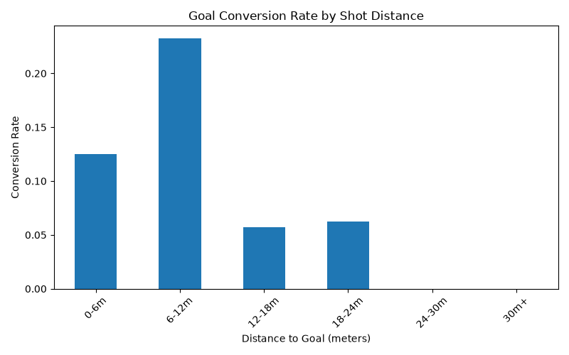

# Stage 1: Shot Distance vs Goal Conversion

**Question:** Does shot distance from goal correlate with scoring likelihood?

**Data:** StatsBomb open data — 146 shots across 5 Bayer Leverkusen matches, 
2023/24 season

**Method:** Correlation analysis + logistic regression

**Finding:** Shot distance has a statistically significant negative effect 
on scoring probability (coefficient = -0.15, p = 0.004). Closer shots are 
meaningfully more likely to result in a goal, though the relationship is 
noisy at close range given limited sample size.

With regards to Bayer Leverkusen, the data shows that the majority of goals
occured at close range. The statistics then indicate, based on a coefficient
of -0.15, that the greater the distance that a shot was taken, the lower
likelihood of a goal being scored. Tactically, this shows that Bayer
Leverkusen should look to work the ball into the box rather than attempting
shots from range, or shooting on sight.

**Limitation:** Data drawn from one team's matches in a single season due 
to StatsBomb's open data access constraints; results may not generalize.

