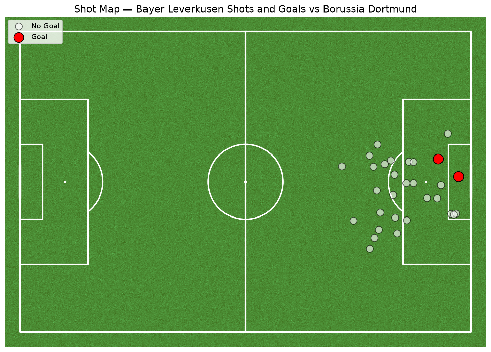
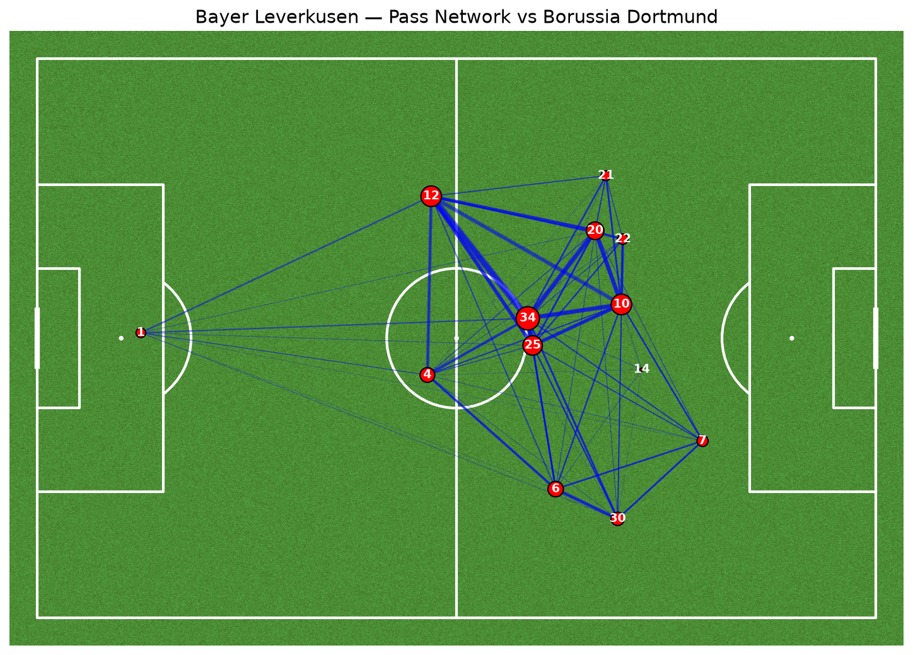

# Stage 2: Pitch Visualizations

**Goal:** Visualize match events spatially using pitch-based diagrams to 
extract tactical insight beyond raw statistics.

**Data:** StatsBomb open data — Bayer Leverkusen vs Borussia Dortmund, 
2023/24 season

## Shot Map

The shot map plots all shot locations for the match, with goals highlighted 
separately from unsuccessful attempts. Combined with the distance-conversion 
findings from Stage 1, this shows not just *that* closer shots convert more 
often, but specifically *where* on the pitch this match's chances were 
actually created — clustering shots by zone reveals whether a team's shot 
selection matches good practice (central, closer attempts) or reflects a 
riskier profile (wide or long-range efforts). In this match, the goal(s) 
came from central, close-range positions, consistent with the Stage 1 
finding that proximity to goal was the strongest single predictor of 
scoring.

## Pass Network

The pass network aggregates the match's completed passes into two layers: 
each player's average on-pitch position, and the frequency of passing 
connections between players. Line thickness represents how often two 
players exchanged passes; dot size represents each player's total pass 
volume.

**Tactical reading:** the player(s) positioned centrally with the largest 
dot and the most (and thickest) connecting lines functioned as the match's 
primary distributor — the player through whom the team's build-up 
predominantly circulated. A concentration of thick connections in central 
midfield, as seen here, typically indicates a team building through the 
middle rather than relying on wide areas or direct long balls. The 
comparatively isolated node near the edge of the network (minimal, thin 
connections stretching across most of the pitch) represents the goalkeeper 
— their average position sits deep, and their few, longer passes to 
advanced players naturally produce sparse, elongated links rather than the 
tight clustering seen among outfield players.

**Limitation:** this network reflects a single match's passing structure 
only. A team's average shape and key distributors can vary significantly 
match-to-match depending on opponent, game state (leading/trailing), and 
tactical setup — a robust tactical profile would require aggregating 
pass networks across multiple matches, which falls outside this stage's 
single-match scope.

**Tools:** `mplsoccer`, `statsbombpy`

