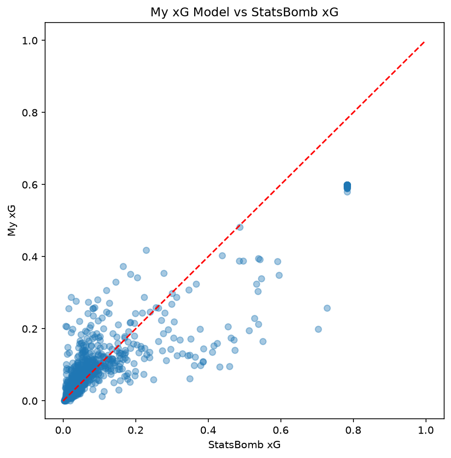

# Stage 3: Expected Goals (xG) Model Built From Scratch

**Goal:** Move beyond single-variable correlation (Stage 1) to a proper 
multi-feature xG model, and validate it against a professional benchmark 
— demonstrating not just that a relationship exists, but understanding 
which specific factors drive scoring probability and why.

**Data:** StatsBomb open data — 790 shots from the 2024 Copa América 
(32 matches)

## How xG Was Calculated

Expected Goals (xG) represents the probability that a given shot results 
in a goal, expressed as a value between 0 and 1. Rather than using 
StatsBomb's own pre-calculated `shot_statsbomb_xg` value, this model was 
built independently from raw shot data to demonstrate the underlying 
methodology.

**Features engineered from raw shot data:**
- **Distance to goal** — calculated using the distance formula (Pythagoras) 
  between the shot's (x, y) coordinates and the goal's fixed position, 
  converted from StatsBomb's native yard-based coordinate system into meters.
- **Shot angle** — the angle (in radians) subtended by the goalposts from 
  the shot's location, calculated using trigonometry. A shot from directly 
  in front of goal has a wider effective angle than the same distance from 
  a tight sideline position, even though the raw distance is identical.
- **Body part** — flagged as a header (1) or other (0), since headers 
  are generally harder to control and convert than shots taken with the foot.
- **Shot type** — flagged as open play (1) or a set piece/penalty (0), 
  since these categories have structurally different scoring rates.
- **Defensive pressure** — whether the shot was taken while under 
  defensive pressure, flagged as a binary indicator.

**Model:** these five features were fed into a logistic regression 
(`statsmodels.Logit`), which estimates the probability of scoring as a 
function of a weighted combination of the inputs. The model was fit on 
all 790 shots, then used to generate a predicted probability — this 
model's own xG value — for every shot in the dataset.

## Key Findings

**Distance, body part, and shot type all mattered — angle and pressure did not.**
Distance to goal, whether a shot was a header, and whether it came from 
open play versus a set piece were all statistically significant predictors 
of scoring (p < 0.01). Shot angle and defensive pressure were not 
significant in this model (p = 0.619 and p = 0.193 respectively). This 
isn't a failure of the model — angle is naturally correlated with distance 
(very wide-angle shots also tend to be further out), so once distance is 
already accounted for, angle adds little additional independent 
information. A model without distance included might show angle as far 
more significant on its own.

**A simple model still closely tracks a professional one.**
Despite using only five features and no defender or goalkeeper positioning 
data, this model's predicted probabilities correlated strongly with 
StatsBomb's own professional xG values (**r = 0.91**). This suggests that 
a small number of well-chosen, interpretable features can capture most of 
the signal in shot quality — the remaining gap is likely explained by 
finer-grained spatial context (how many defenders were between the shooter 
and goal, whether the goalkeeper was positioned well) that isn't present 
in this simpler feature set.

**The model correctly separates penalty kicks as a distinct shot category.**
All five penalties in the dataset clustered tightly around ~60% predicted 
conversion — visible as the distinct point cluster in the comparison chart 
below, sitting apart from the main distribution of open-play shots. This 
is a meaningful sanity check: a well-built xG model should recognize that 
penalties behave fundamentally differently from open-play attempts, and 
this one does, without penalties being explicitly hard-coded as a special 
case.

## Comparing This Model to StatsBomb's Own xG

StatsBomb includes its own professionally-calculated xG value for every 
shot (`shot_statsbomb_xg`), built using a substantially more sophisticated 
model than the one here — notably, StatsBomb's model incorporates 
freeze-frame data showing the exact position of every defender and the 
goalkeeper at the moment of the shot, which this simpler model has no 
access to.

The comparison chart below plots every shot's StatsBomb xG (x-axis) 
against this model's xG (y-axis), with a red dashed reference line 
showing where the two would sit if they agreed perfectly. Most shots 
cluster tightly along that line, particularly at lower xG values 
(long-range, low-probability attempts), where both models confidently 
agree these are unlikely to score.

The clearest point of disagreement is the cluster of five points sitting 
noticeably above the diagonal around (0.8, 0.6) — these are the dataset's 
five penalty kicks. Both models correctly identify penalties as 
high-probability chances, but StatsBomb rates them meaningfully higher 
(~0.8) than this model does (~0.6). This likely reflects StatsBomb's model 
having penalty-specific historical conversion data baked in directly, 
whereas this model only distinguishes penalties indirectly via the 
"open play" flag — a cruder signal that likely underweights just how 
reliably penalties convert compared to other set pieces.

A second notable divergence: one shot StatsBomb rated at 0.46 that this 
model rated at only 0.17. Without freeze-frame data, this model has no way 
to know whether a shot faced an open goal or a heavily blocked one — it 
can only infer difficulty from distance, angle, and shot type. This is the 
clearest illustration of this model's ceiling: it captures the broad shape 
of shot quality well (r = 0.91 overall), but misses shot-specific defensive 
context that a more complete model would need to incorporate.

## Limitation

This model's ceiling is set by its lack of positional/spatial context 
(defender and goalkeeper positioning at the moment of the shot). Where 
this model diverges most from StatsBomb's xG, the gap consistently traces 
back to information this simpler model structurally cannot see — how the 
defense was set up at the moment of the shot. A natural next step would 
be incorporating StatsBomb's freeze-frame data directly as additional 
features, which would likely close much of the remaining gap with 
StatsBomb's own xG values.

**Tools:** `statsmodels`, `statsbombpy`, `pandas`, `numpy`, `matplotlib`

