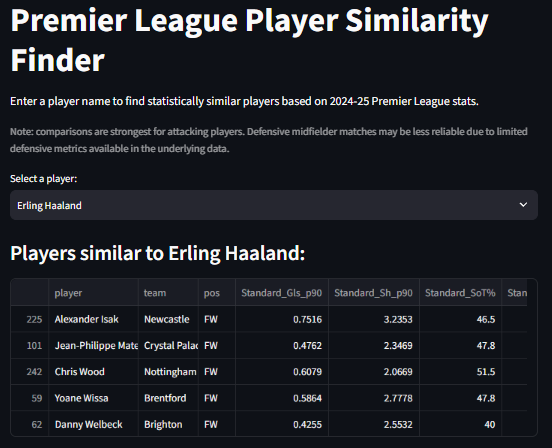

# Football Analytics Portfolio

A collection of football data analysis projects combining my background as 
a football coach with a growing interest in data analytics. Built using 
Python and open-source football data, progressing from foundational data 
analysis through to a deployed, interactive tool.

## Featured: Player Similarity Engine

An interactive scouting-style tool that finds statistically similar 
Premier League players — mimicking a real recruitment workflow. Built 
using per-90 stats from FBref, clustered via cosine similarity, and 
deployed as a live app.

**[→ View Stage 4](./04-player-similarity)**

## Interactive App

**Live app: [Premier League Player Similarity Finder](https://football-analytics-mrbbroanuyjpffm3ksutjb.streamlit.app)**

## Project Stages

This repo is organized as a progressive skill-building journey, each stage 
building on the last:

### [Stage 1: Shot Distance vs Goal Conversion](./01-eda-shot-data)
Exploratory data analysis and logistic regression on StatsBomb shot data, 
testing whether shot distance predicts scoring likelihood.

### [Stage 2: Pitch Visualizations](./02-pitch-viz)
Shot maps and pass networks built with `mplsoccer`, visualizing match 
events spatially rather than statistically.

### [Stage 3: Expected Goals (xG) Model From Scratch](./03-xg-model)
A multi-feature logistic regression xG model built from raw shot data, 
validated against StatsBomb's own professional xG values (r = 0.91).

### [Stage 4: Player Similarity Engine](./04-player-similarity)
A k-nearest-neighbors similarity engine comparing Premier League players 
by playing style, deployed as a live Streamlit app.

## Tools & Libraries

Python, pandas, numpy, matplotlib, `statsmodels`, `mplsoccer`, 
`statsbombpy`, `soccerdata`, `scikit-learn`, `streamlit`

## Data Sources

- [StatsBomb Open Data](https://github.com/statsbomb/open-data) 
  (Stages 1–3)
- [FBref](https://fbref.com/) via `soccerdata` (Stage 4)

## About

This is my first venture into data analytics. Each stage's README includes 
the specific question asked, method used, findings, and honestly-stated 
limitations — I've tried to be transparent about where the data or 
methods have real constraints, rather than overstating what each analysis